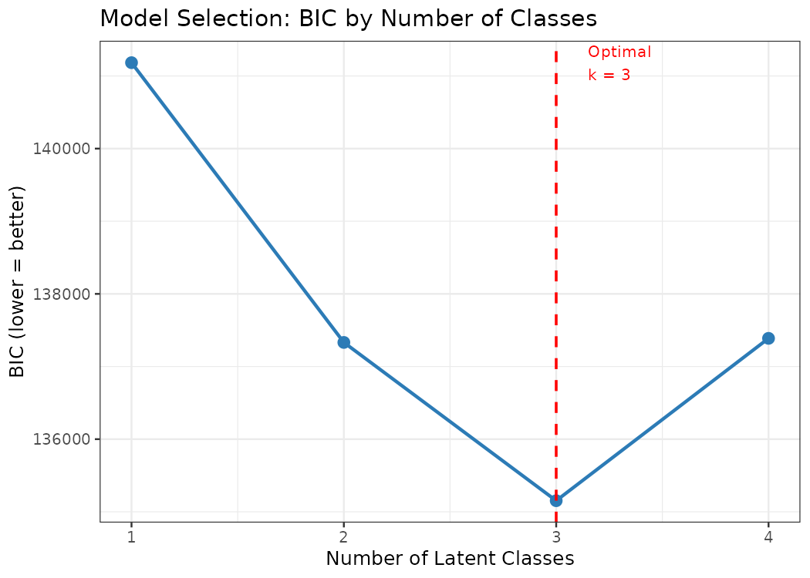
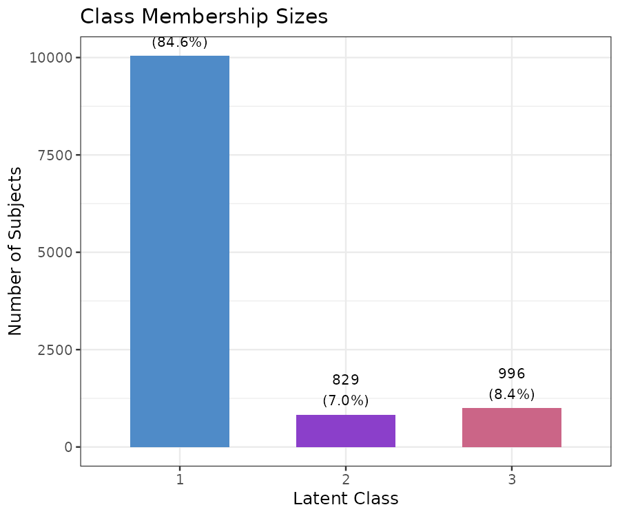
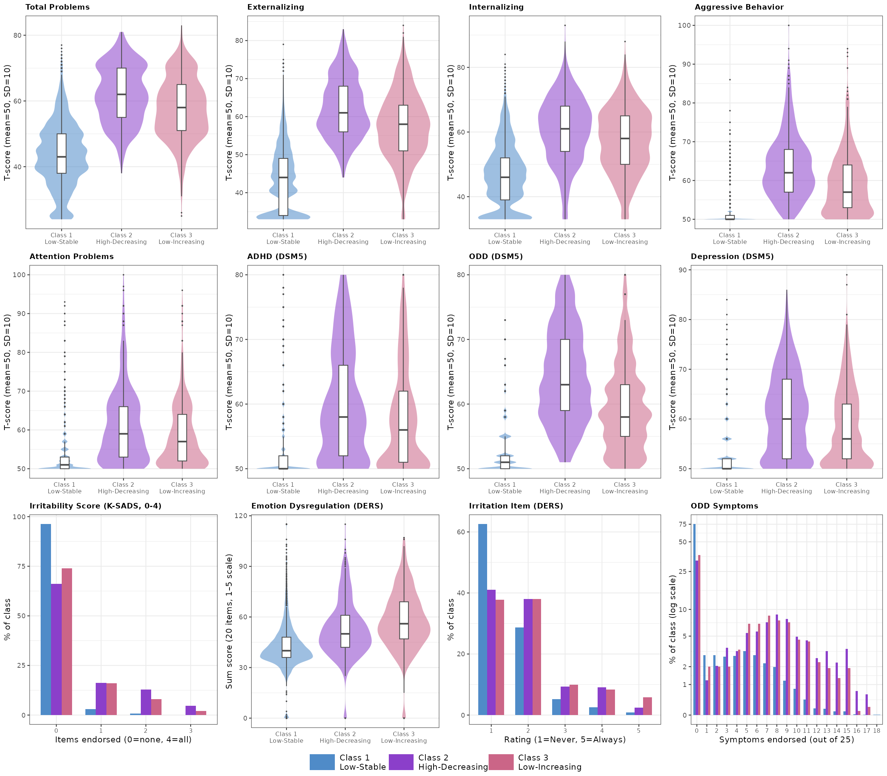
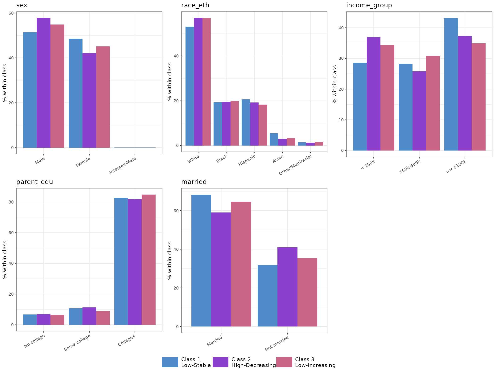

## Overview

This project uses Latent Class Growth Analysis (LCGA) to identify distinct irritability trajectory classes in children from the **Adolescent Brain Cognitive Development (ABCD) Study**. After identifying trajectory classes, baseline demographic and clinical variables are compared across classes to characterize who falls into each group.

---

## Repository Structure

```
.
├── Clinical/
│   ├── lcga_abcd_irritability.R       # LCGA model fitting + class assignment
│   └── lcga_classification.R          # Class characterization + plots
├── lcga_output/
│   ├── lcga_class_assignments.csv     # Per-subject class assignments
│   ├── characterization_summary.csv   # Table 2: means/% + FDR-corrected p-values
│   ├── characterization_pairwise.csv  # Dunn pairwise comparisons (FDR-corrected)
│   ├── characterization_cbcl_plots.png
│   ├── characterization_demo_plots.png
│   ├── lcga_trajectories.png
│   ├── lcga_bic_plot.png
│   └── lcga_class_sizes.png
└── README.md
```

---

## Data

All data come from the **ABCD Study (Release 4.0)**, package `Package_1215452`. The following files are used:

| File | Contents |
|---|---|
| `pdem02.txt` | Demographics (age, sex, race/ethnicity, income, education) |
| `abcd_cbcls01.txt` | CBCL syndrome + DSM-oriented T-scores |
| `abcd_ksad01.txt` | K-SADS ADHD symptom items |
| `diff_emotion_reg_p01.txt` | DERS parent-report emotion dysregulation |
| `opp_defiant_disorder_p01.txt` | K-SADS ODD symptom items |

Data are not included in this repository and must be obtained through the [ABCD Study](https://abcdstudy.org/).

---

## Methods

1. **LCGA** is fit on parent-reported irritability scores across up to 4 timepoints
2. Model selection uses BIC across 2–5 class solutions
3. The best-fitting model is used to assign each subject to a latent class
4. Baseline variables are compared across classes using Kruskal-Wallis tests (continuous) and chi-square tests (categorical), with FDR correction applied across all omnibus tests
5. Dunn pairwise post-hoc tests are run with FDR correction for significant omnibus results

---

## Trajectory Classes

Three irritability trajectory classes were identified:

| Class | Label | Description |
|---|---|---|
| 1 | Low-Stable | Low irritability maintained across time |
| 2 | High-Decreasing | Elevated irritability that decreases over time |
| 3 | Low-Increasing | Low initial irritability that increases over time |

### Trajectories


### Model Selection (BIC)


### Class Sizes


---

## Results

### Clinical Characterization


### Demographic Characterization


---

## Requirements

R packages: `tidyverse`, `data.table`, `ggplot2`, `gridExtra`, `RColorBrewer`, `dunn.test`, `lcmm`

Install all at once:
```r
install.packages(c("tidyverse", "data.table", "ggplot2",
                   "gridExtra", "RColorBrewer", "dunn.test", "lcmm"))
```

---

## Usage

Set the path to your ABCD data package, then run the two scripts in order:

```bash
Rscript Clinical/lcga_abcd_irritability.R
Rscript Clinical/lcga_classification.R
```

Output files will be written to `lcga_output/`.
